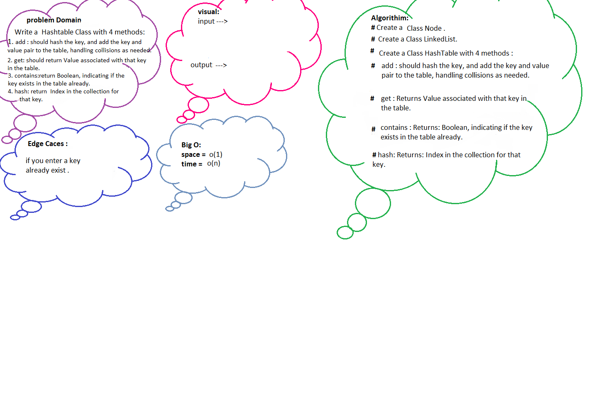

# Code Challenge: Class 30: Hash Table Implementation
## Hashtables 
Hashtables are a data structure that utilize key value pairs. This means every Node or Bucket has both a key, and a value.

Basically, a hash code turns a key into an integer. It’s very important that hash codes are deterministic: their output is determined only by their input. Hash codes should never have randomness to them. The same key should always produce the same hash code.

 ## Challenge Description
 Implement a Hashtable Class with the following methods:

* add
Arguments: key, value
Returns: nothing
This method should hash the key, and add the key and value pair to the table, handling collisions as needed.
* get
Arguments: key
Returns: Value associated with that key in the table
* contains
Arguments: key
Returns: Boolean, indicating if the key exists in the table already.
* hash
Arguments: key
Returns: Index in the collection for that key 

## WhiteBaord

