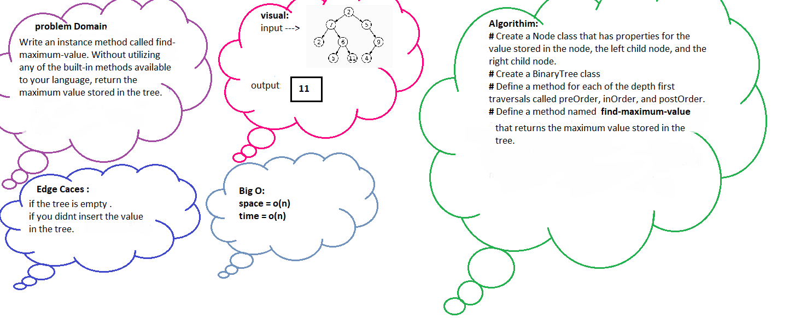

# Code Challenge 32
## Find common values in 2 binary trees.

***
**The “intersection” of two trees is a tree with nodes numbered both 1 and 2, and the “union” is a tree with nodes numbered either 1 or 2, or both. ... For example, the intersection of trees in Figures 1 and 2 is a tree in Figure 3, and the union of them is a tree in Figure 4.**

***
## Feature Tasks
Find all values found to be in 2 binary trees

* Write a function called tree intersection
* Arguments: two binary trees
* Return: array

## WhiteBoard
***

