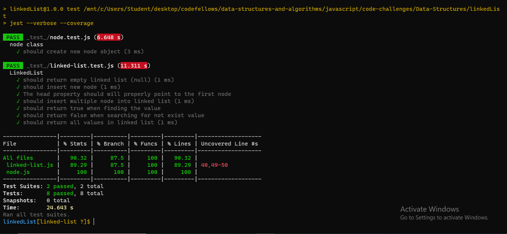
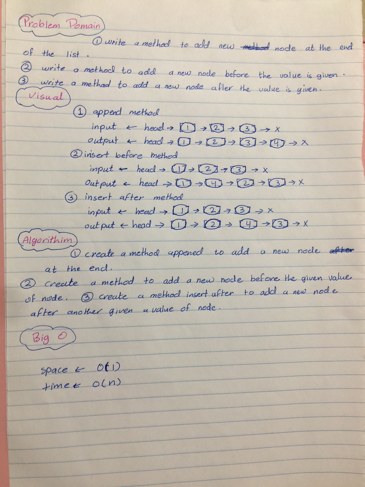

## CODE CHALLENGE FIVE : LINKED LISTS

|file name|link|
|:-------:|:---|
|readmecc1|[GitHub link](https://github.com/Tasnimwheebi/data-structures-and-algorithms/blob/array-reverse/javascript/code-challenges/array-revers/readme.md)|
|readmecc2|[GitHub link](https://github.com/Tasnimwheebi/data-structures-and-algorithms/blob/array-reverse/javascript/code-challenges/array-shift/readme.md)|
|readmecc2|[GitHub link](https://github.com/Tasnimwheebi/data-structures-and-algorithms/blob/array-binary-search/javascript/code-challenges/array-binary-search/readme.md)|
|readmecc2|[GitHub link](https://github.com/Tasnimwheebi/data-structures-and-algorithms/blob/linked-list/javascript/code-challenges/Data-Structures/linkedList/readme.md)|

