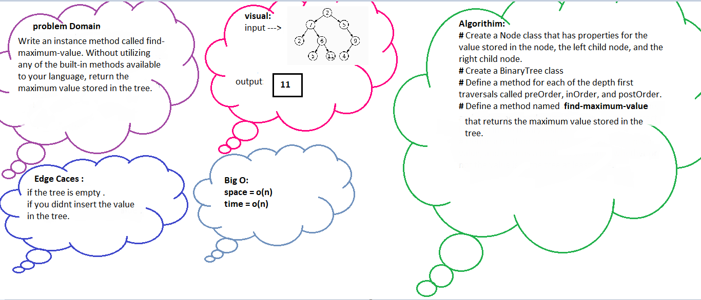

## **Code challenge 15**

**Write an instance method called find-maximum-value**

**Return the maximum value stored in the tree. You can assume that the values stored in the Binary Tree will be numeric.**

## **Code challenge 16**

**Write an instance method called find-maximum-value**

**Return the maximum value stored in the tree. You can assume that the values stored in the Binary Tree will be numeric.**

## **Code challenge 17**

**A a breadth first traversal method which takes a Binary Tree as its unique input.**

**Return a list of the values in the tree in the order they were encountered.**
