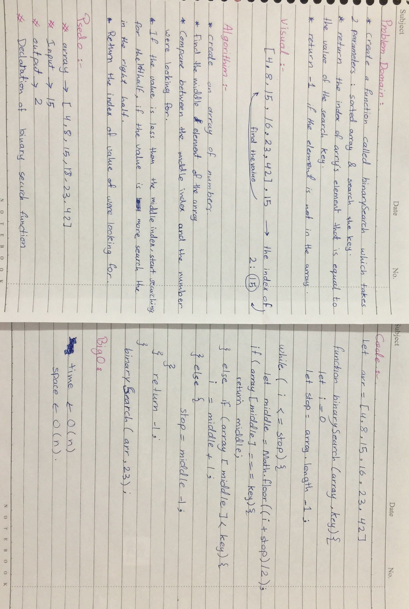
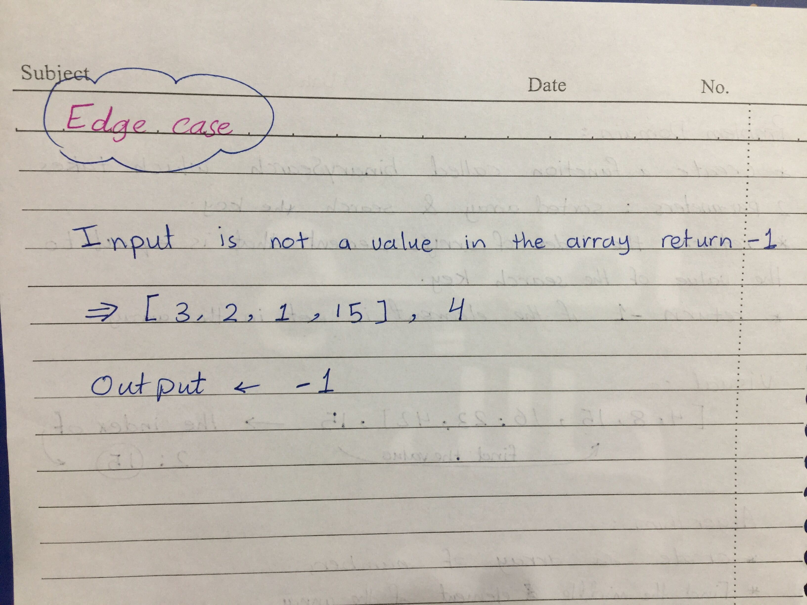

|file name|link|
|:-------:|:---|
|readmecc1|[GitHub link](https://github.com/Tasnimwheebi/data-structures-and-algorithms/blob/array-reverse/javascript/code-challenges/array-revers/readme.md)|
|readmecc2|[GitHub link](https://github.com/Tasnimwheebi/data-structures-and-algorithms/blob/array-reverse/javascript/code-challenges/array-shift/readme.md)|
|readmecc2|[GitHub link](https://github.com/Tasnimwheebi/data-structures-and-algorithms/blob/array-binary-search/javascript/code-challenges/array-binary-search/readme.md)|

[code link](https://replit.com/@tasnimwheebi/LustrousWiryDimension#index.js)

    let arr = [4, 8, 15, 16, 23, 42]
      function binarySearch(array, key){
       let start = 0;
         let end = array.length - 1;
       while (start <= end) {
       let middle = Math.floor((start + end) / 2);
        if (array[middle] === key) {
            return middle;
        } else if (array[middle] < key) {
            start = middle + 1;
        } else {
            end = middle - 1;
        }
    }
    return -1;
    }
    binarySearch(arr,23);
  

