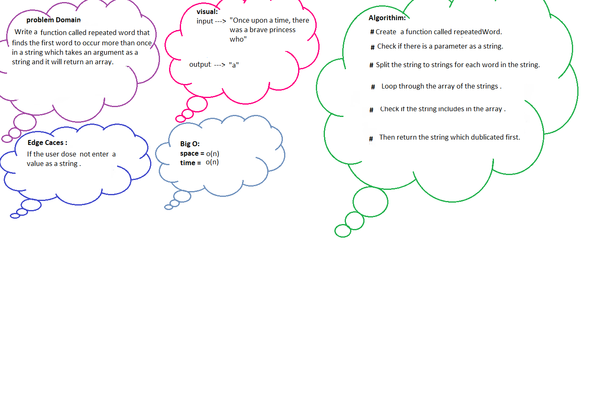

# Code Challenge: Class 31

## Description :
Function : Find the first repeated word in a book.

### Feature Tasks
Write a function called repeated word that finds the first word to occur more than once in a string :
* Arguments: string
* Return: string

## WhiteBoard 

