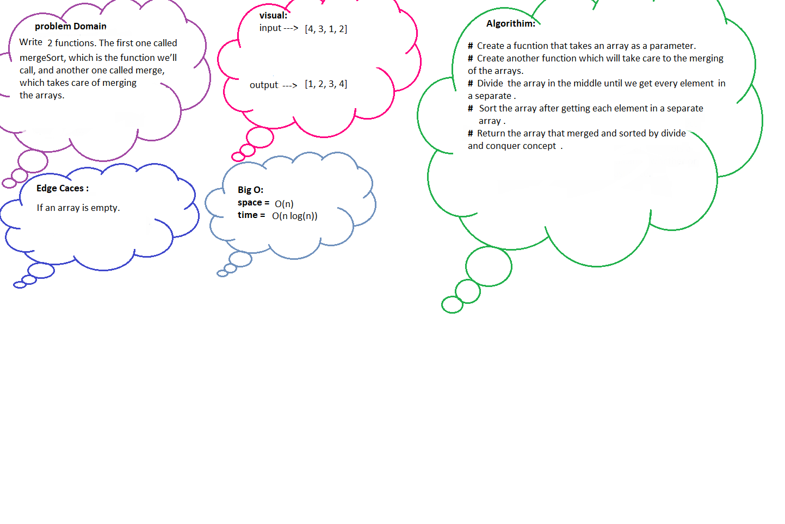

## Code Challenge 
Merge sort is a sorting algorithm that uses the “divide and conquer” concept. Given an array, we first divide it in the middle and we get 2 arrays. We recursively perform this operation, until we get to arrays of 1 element.

