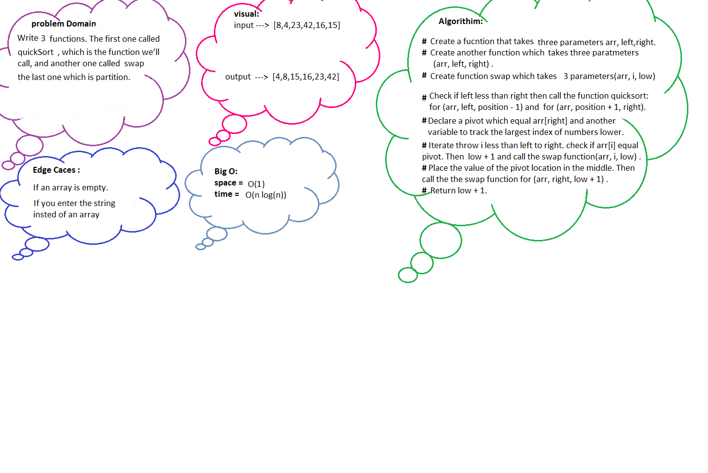

# Code challenge 28 

## What is Quick sort?
Quick sort follows Divide and Conquer algorithm. It is dividing elements in to smaller parts based on some condition and performing the sort operations on those divided smaller parts.
****
## WhiteBoard
